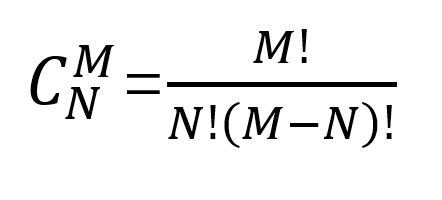

### Function

Python function defination is similiar to its mathmatic defination. A special relationship where each input has a single output. The reason why do we need function is to make some programming easier. The syntax of a function will not be explained here. Please go to this [page](<https://www.tutorialspoint.com/python/python_functions.htm>) for pre-knowledge. Here I will use examples to show why do we need function and applications to function.


#### A function example
> This example is from user **jackfreued** . His tutorial is in Chinese. Here is his [page](<https://github.com/jackfrued>).  


First, let's look at the following equation. Try to think how many positive integer solutions do we have.


It is very easy to think that this is a arrangement/combination problem. Think of it like this way. There are 4 gourps of people and 8 apples. You need to distribute each group at least 1 apple. How many distribution solutions?
The solution should be `C(7,3) = 35`.
**In fact, this is high school knowledge, I almost fogot**




Now, if we use **while** loop to calculate, the potential code is as follow:

```python

m = int(input('m = '))
n = int(input('n = '))
# To calculate factorial for m.
fm = 1
for num in range(1, m + 1):
    fm *= num
# To calculate factorial for n
fn = 1
for num in range(1, n + 1):
     fn *= num
# To calculate factorial for m-n
fm_n = 1
for num in range(1, m - n + 1):
      fm_n *= num
# To calculate C(M,N)
print(fm//fn//fm_n)

```
